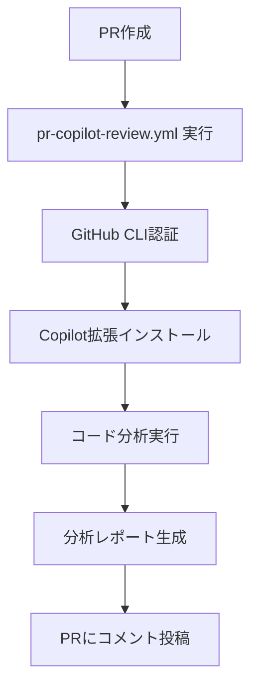

# GitHub Actions & Copilot Setup Guide

## 🤖 GitHub Copilot CLI 統合ワー- **フォールバック**: Copilot利用不可時は基本分析

## 🛠️ トラブルシューティング

### よくある問題と解決法

#### 1. 文字化け・エンコーディング問題
```yaml
⚠️ Review contains garbled characters
分析結果に文字化けが発生する場合:
- UTF-8 encoding conflicts
- BOM (Byte Order Mark) presence  
- Terminal locale settings
```

**対処法:**
- ワークフローでUTF-8環境変数を設定済み (`LC_ALL=C.UTF-8`)
- BOM除去処理を自動実行
- 非ASCII文字の安全な処理を実装
- タイムアウト時間を30秒に延長

#### 2. Copilot拡張インストール失敗のプロジェクトには以下のワークフローが設定されています：

### 📋 アクティブなワークフロー

1. **`pr-copilot-review.yml`** - GitHub Copilot CLI コードレビュー
   - PR作成時に自動実行
   - `gh copilot suggest` と `gh copilot explain` を使用
   - 実際の有償Copilotライセンスを活用

2. **`auto-pr-review.yml`** - 自動PR作成とレビュー
   - コード変更時に自動PR作成
   - ラベリングとプリレビュー分析

## 🔑 必須設定: GitHub Actions 権限

### PR作成権限エラーの解決

```
pull request create failed: GraphQL: GitHub Actions is not permitted to create or approve pull requests
```

**解決手順:**

1. **リポジトリSettings → Actions → General**
2. **Workflow permissions**:
   ```
   ○ Read and write permissions
   ☑️ Allow GitHub Actions to create and approve pull requests
   ```
3. **Save** をクリック

### 🤖 GitHub Copilot ライセンス設定

**前提条件:**
- GitHub Copilot Business または Individual ライセンス
- ライセンスはあなたのアカウントで既に有効

**確認方法:**
```bash
# ローカルでテスト
gh extension install github/gh-copilot
gh copilot suggest "コード改善の提案をお願いします"
```

## 📊 ワークフロー実行フロー

### 1. PR作成時の自動実行



### 2. 実際の実行内容

- **認証**: `GH_TOKEN` 環境変数方式
- **Copilot分析**: 
  - `gh copilot suggest` でコード改善提案
  - `gh copilot explain` でコード解説
  - 30秒タイムアウト付きでエラーハンドリング
- **フォールバック**: Copilot利用不可時は基本分析

## �️ トラブルシューティング

### よくある問題と解決法

#### 1. Copilot拡張インストール失敗
```yaml
⚠️ Copilot extension installation failed
Possible reasons:
- GitHub Copilot license required
- Network connectivity issues
- Extension not available in this environment
```

**対処法:**
- Copilotライセンスの有効性確認
- アカウント設定でCopilot有効化

#### 2. 認証エラー
```yaml
❌ GH_TOKEN environment variable is not set
```

**対処法:**
- Repository Secrets の `GITHUB_TOKEN` 確認
- Workflow permissions の設定確認

#### 3. API制限・タイムアウト
```yaml
⚠️ Copilot API が一時的に利用できません（タイムアウトまたはレート制限）
```

**対処法:**
- 自動的にフォールバック分析が実行されます
- タイムアウト時間を30秒に延長済み
- エンコーディングエラーの自動処理を実装
- 文字化け対策として `iconv` による文字変換を追加
- 後でローカルでCopilot機能を使用できます

## 🚀 使用方法

### 自動PR作成テスト

```bash
# 1. 新機能ブランチ作成
git checkout -b feature/test-copilot-review

# 2. コード変更
echo "// Copilot integration test" >> public/js/game.js

# 3. コミット・プッシュ
git add .
git commit -m "feat: Copilot integration test"
git push origin feature/test-copilot-review

# 4. 結果確認
# - Actions タブでワークフロー実行確認
# - PRに自動投稿されるCopilot分析レポート確認
```

### 手動PR作成（推奨）

```bash
# GitHub CLI使用
gh pr create \
  --title "🤖 Copilot Review Test" \
  --body "GitHub CLI Copilot機能のテスト" \
  --base main
```

## 📈 期待される結果

### 成功時の出力例（文字化け対策済み）

```markdown
## 🤖 GitHub Copilot CLI レビュー分析

### 📅 分析実行日時: 2025-08-29 14:30:00

### 📄 変更されたファイル一覧
```
public/js/game.js
```

### 🤖 GitHub Copilot CLI 分析結果

✅ **GitHub Copilot CLI 拡張機能が利用可能です**

📋 Review file encoding check:
copilot_cli_review.md: UTF-8 Unicode text
📊 File size: 2048 bytes
📄 Line count: 42 lines

#### 🎯 プロジェクト改善提案

**🤖 GitHub Copilot からの提案:**
- ゲームロジックのモジュール化
- エラーハンドリングの強化  
- パフォーマンス最適化
- コメントの充実

📝 注意: 非ASCII文字は自動的に安全な形式に変換されます
```

### 文字化け防止機能

- **UTF-8エンコーディング強制**: `LC_ALL=C.UTF-8` 環境変数設定
- **BOM除去**: ファイル先頭のByte Order Mark自動削除
- **文字変換**: `iconv` による安全な文字変換
- **フォールバック**: エンコーディングエラー時の代替処理

## 💡 追加の推奨設定

### Branch Protection Rules

```yaml
# .github/settings.yml (推奨)
branches:
  - name: main
    protection:
      required_status_checks:
        strict: true
        contexts:
          - "copilot-cli-review"
      required_pull_request_reviews:
        required_approving_review_count: 1
```

### 通知設定

- PR作成時の通知有効化
- Copilotレビュー完了時の通知
- 失敗時のメール通知

---

🤖 **GitHub Copilot CLI 統合により、コードレビュープロセスが大幅に改善されます！**
